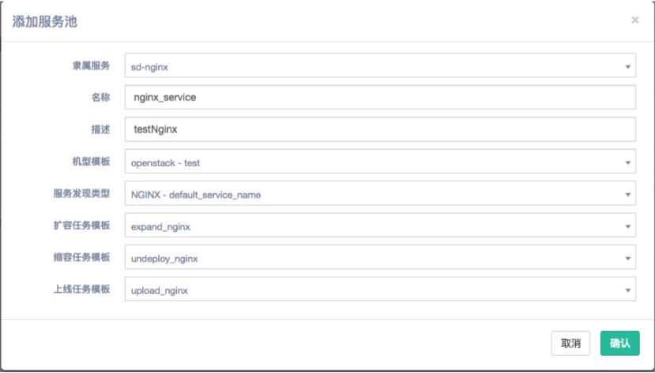

# 服务编排使用手册

## 准备工作

在使用服务编排功能之前，需要先初始化openstack环境，具体可参考[虚拟化管理使用手册](openstack.md)。

同时还需要创建进行服务编排所需的机型模板，具体操作如下：

### 1.进入opendcp，选择多云对接模块下的机型模板,并点击创建按钮。

###2.编辑创建模板按钮，创建名为test的openstack机型模板，具体模板的创建过程可参考[用户手册](usermanual.md)。

###3.为新建的机型模板添加配额，假设添加100。**（必须添加配额，否则将无法正常扩容！）**

## 服务编排

在正确创建了可用的机型模板后可进入服务编排模块。

### 1.点击服务编排模块，选择服务管理，并切换到默认集群。

### 2.进入服务池，选择nginx服务，并点击创建按钮进行服务池的创建。

### 3.创建名为nginx_service的服务池，机型模板选择刚刚新建的模板，服务发现类型缺省，扩容任务模板选择expand_nginx,缩容任务模板选择undeploy_nginx，上线任务模板选择upload_nginx，点击确认。

### 4.同理选择my_server服务，创建名为server_service的服务池，配置信息如下：

### 5.创建了服务池后便可执行扩容操作，点击扩容按钮，选择扩容数量，确认后便可在服务池的节点中查看到扩容的节点。

### 6.点击opendcp的服务发现模块，选择七层Nginx中的Nginx单元,并点击录入按钮。

### 7.输入之前扩容的nginx节点的IP地址，点击提交后录入成功。

### 8.同理，可在server服务池中扩容，并查看到已扩容的节点。（注意：先扩容nginx服务池，注册后再扩容server服务池，否则会出现server服务池扩容失败的问题。）

## 验证服务

### 在浏览器中输入之前扩容的server节点，选择8080端口，看到如下页面后表明服务编排成功

