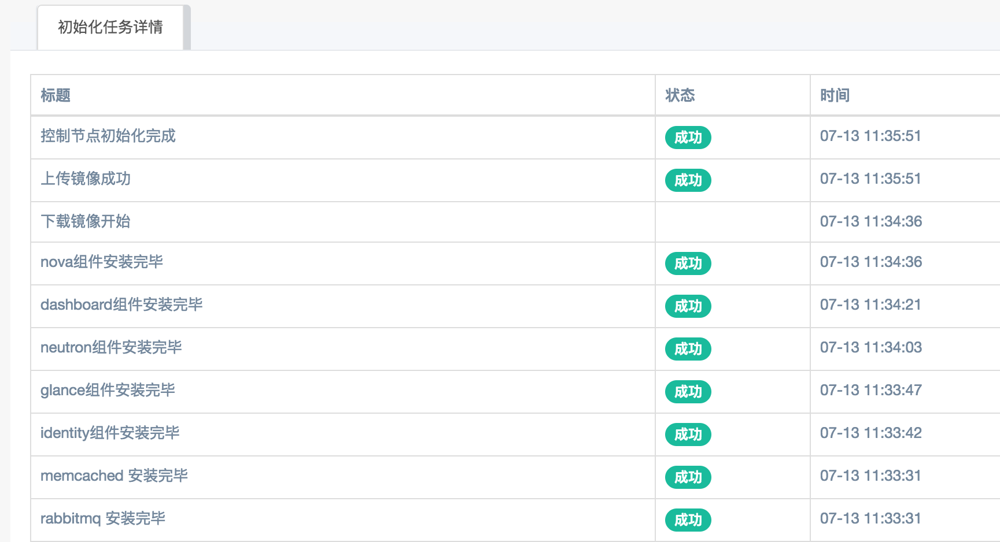
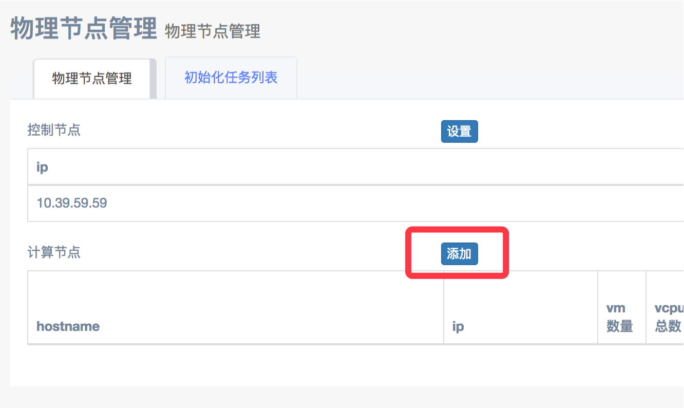

# 虚拟化管理使用手册

## 准备工作
在使用虚拟化管理功能之前，需要做一些准备工作

- **服务器环境准备** ：
 -  初始化服务器操作系统为CentOS7，目前虚拟化管理的openstack安装脚本，支持CentOS操作系统，在CentOS 7.1.1503, 7.2.1511 和 7.3.1611版本上测试通过
 
 -  在服务器开机BIOS设置中，打开Intel VT-x虚拟化功能，打开此选项后，服务器上作出的虚拟机性能才能达到使用水平，如果没有打开，那么虚拟机性能会差到几乎无法使用
 
 -  请配置服务器能够访问外网

- **网络环境准备** ：
 -  请准备一个网段（例如，一个C段），或一个网段下的几个IP，用于虚拟机的ip分配，此网段的服务器可与内网其他服务器互通。
  >  例如：可以给一个接入交换机配置一个完整C段，物理服务器接在这个接入交换机下  
   例如：可以划分vlan，将几台接入交换机下的不同端口配置成一个C段，  
   例如：可以划分vlan，并在接入交换机上设置端口为trunk模式，允许服务器上的虚拟机处在几个不同vlan  
  
 -  请在这个网段准备两台物理服务器，一台作为控制节点，一台作为计算节点，计算节点的数量可随时增加
 
## 开始安装
### 安装控制节点
-  打开OpenDCP的虚拟化管理—》物理节点管理 页面
-  点击控制节点的设置按钮

-  填写控制节点的ip 和 root账户登录密码，例如填写控制节点ip：10.39.59.59

-  在初始化任务列表页面，可以看到控制节点的安装进度  

-  等待控制节点安装完成，状态将会更改为执行完成  
-  控制节点目前只允许有一台，重新点击设置按钮，会替换原有的控制节点  

### 安装计算节点
-  请在成功安装了控制节点之后再进行计算节点的安装，否则可能导致计算节点安装失败
-  打开OpenDCP的虚拟化管理—》物理节点管理 页面
-  点击计算节点的添加按钮

-  填写计算节点的ip 和 root账户登录密码，例如填写控制节点ip：10.39.59.30

-  在初始化任务列表页面，可以看到计算节点的安装进度
-  等待计算节点安装完成，状态将会更改为执行完成
-  安装完成后，可以在物理节点管理页面，看到已装的计算节点列表，并能看到每台计算节点上的虚机个数、CPU、内存使用情况等信息
-  依照上面步骤可以重复添加多台计算节点

## openstack环境设置
上面步骤已安好一个可用的openstack环境，在创建虚拟机之前，还需要在openstack控制台进行几项基本设置

### 配置网络
-  请在控制节点和至少一台计算节点安装完成后，进行网络设置
-  访问openstack控制台，使用控制节点的ip访问，例如：http://10.39.59.59/dashboard
-  登录控制台 域：default   用户名：admin   密码：root

-  打开 管理员－》系统－》网络 页面
-  点击创建网络按钮，创建一个新网络，可根据事先准备好的网络环境进行设置，选择平面或VLAN或其他类型的网络，例如：

>   名称：mynet  
   项目：admin  
   网络类型：平面  
   物理网络：provider   
   共享：勾选
-  添加成功后，点击mynet，进入网络编辑页面
-  点击创建子网按钮，创建子网，例如：

 >    名称: mysubnet  
     网络地址: 事先准备好的网段cidr，例如 10.39.59.0/24  
     网关IP： 事先准备好的网段网关ip，例如 10.39.59.1  
     子网详情－启用dhcp勾选  
     子网详情－分配池，填写事先准备好的ip列表，可在一行内填写连续ip的开头和结尾，以逗号隔开  
     例如填写 10.39.59.40, 10.39.59.42 则会有40、41、42 3个ip可供分配（其中一个ip会分给dhcp，所以总共有2个ip可分给虚拟机）  
     可填写多行  比如  
     第一行 10.39.59.40,10.39.59.42  
     第二行 10.39.59.82,10.39.59.89  

 -  点击创建
 
 
### 创建机型 

-  在openstack控制台打开 管理员－》系统－》flavor数 页面
-  点击创建flavor，根据计算节点物理资源的多少，可自定义虚拟机的配置，例如，可创建

 > 名称: 4C-4G-8G  
    vcpu  4  
    内存  4096  
    根磁盘   8   
 
 
### 修改安全组规则 

-  默认的default安全组不允许icmp协议和tcp协议的入方向流量，可打开限制
-  在openstack控制台打开 项目 －》 计算 －》 访问 & 安全
-  点击default安全组后的管理规则
-  添加所有ICMP协议，入口方向允许规则
-  添加所有TCP协议，入口方向允许规则

 
  
### 至此，openstack环境安装和配置完成 

