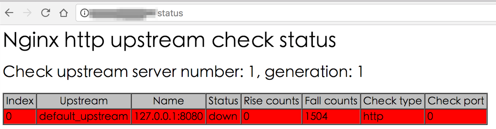
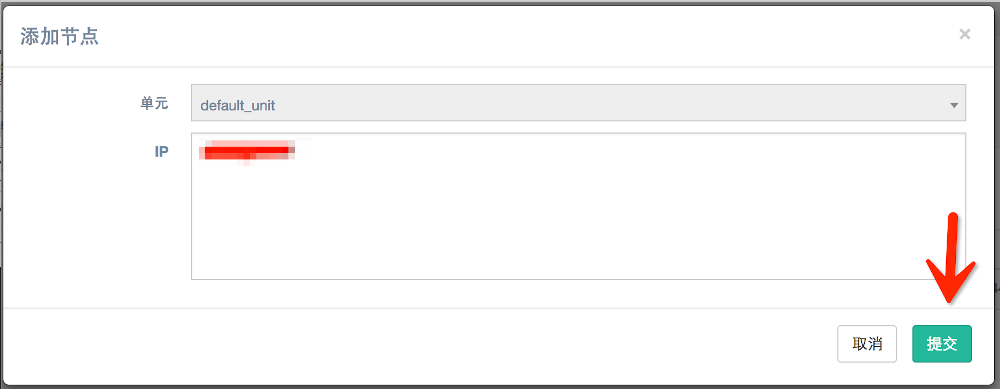

# 快速开始

## 概览

此演示主要目的为让用户快速了解系统主要功能的使用,所以用系统内自带的各种模板/实例进行演示. 跟用户的业务无关.

>### 演示使用7层nginx作为服务发现类型,总共分以下两大步:  
> 1. 建立 服务发现模块 使用的机器  
> 2. 扩容业务机器.并通过服务发现..自动将新扩容的机器对外提供服务

## 建立 服务发现模块 使用的机器

 1. 服务编排->服务管理 找到名称为sd-nginx的服务
 2. 进入sd-nginx下属的服务池
 3. 点击扩容,输入扩容数量.如图:
 
 4. 进入到 服务编排->任务管理 查看上一步的任务执行情况.如图:
  
    * 点击详情查看详细信息..
    * 点击日志查看详细扩容日志.如图:
    
    * 正常情况下执行成功后..将看到的ip粘贴在浏览器窗口中.检查确认nginx正常运行.地址格式如:
    访问nginx服务器的状态页..http://nignx_lb_ip/status
    如图:
 5. 将此机器加入nginx单元里.服务发现->7层nginx->Nginx单元.在下属单元中点击添加.将ip添加进去..如图:
 
 6. 在节点标签可以检查现有节点..如图:
 
 

## 扩容业务机器
我们此处用my_server服务为例.用户可根据需要,在自己的服务上进行扩容,具体操作流程如下

 1. 服务编排->服务管理 找到名称为my_server的服务
 2. 进入my_server下属的服务池,找到my_server_nginx
 3. 点击扩容,输入扩容数量.如图:
 4. 进入到 服务编排->任务管理 查看上一步的任务执行情况.如图:
    * 点击详情查看详细信息..
    * 点击日志查看详细扩容日志.如图:
 5. 正常情况下执行成功后..将看到的新扩容机器的ip
 6. 检查新扩容机器是否完成服务注册.访问nginx服务器的状态页..http://nignx_lb_ip/status
此处nignx_lb_ip为第一大步中建立的服务发现nginx服务器的i
检查新扩容的机器在status页中是否显示正常(白色正常,红色不正常).如图:

