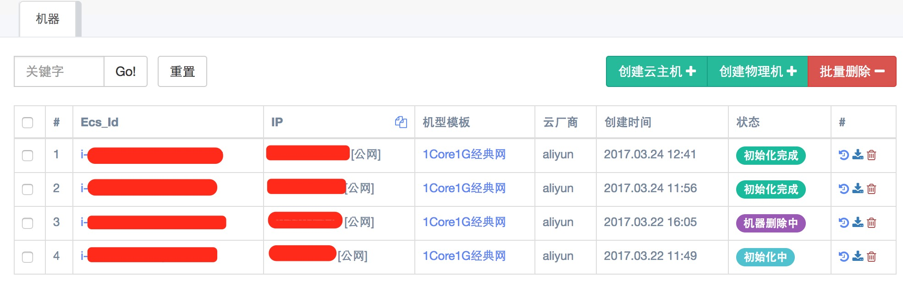
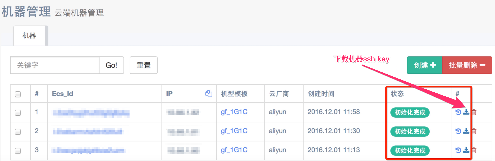

# DCP开源混合云平台用户手册

# 目录

[1. 引言 ](#1-引言)

[1.1 标识 ](#11-标识)

[1.2 系统概述 ](#12-系统概述)

[1.3 体系架构 ](#13-体系架构)

[1.4 文档概述 ](#14-文档概述)

[1.5 名词解释 ](#15-名词解释)

[2. 软件综述 ](#2-软件综述)

[2.1 软件应用 ](#21-软件应用)

[2.2 用户角色说明 ](#22-用户角色说明)

[2.3 授权和使用 ](#23-授权和使用)

[3. 多云对接 ](#3-多云对接)

[3.1 机型模版 ](#31-机型模版)

[3.1.1 添加配额 ](#311-添加配额)

[3.1.2 创建机器 ](#312-创建机器)

[3.2 机器管理 ](#32-机器管理)

[3.3 多云对接配置 ](#33-多云对接配置)

[4. 镜像市场 ](#4-镜像市场)

[4.1 打包系统 ](#41-打包系统)

[4.1.1 进入菜单 ](#411-进入菜单)

[4.1.2 创建 ](#412-创建)

[4.1.2.1 部署介质参数说明 ](#4121-部署介质参数说明)

[4.1.2.2 定义方式说明 ](#4122-定义方式说明)

[4.1.2.3 Dockerfile子命令说明 ](#4123-子命令说明)

[4.1.3 提交 ](#413-提交)

[4.1.4 构建 ](#414-构建)

[4.1.5 查看状态 ](#415-查看状态)

[4.2 镜像仓库 ](#42-镜像仓库)

[4.3 base镜像维护 ](#43-base镜像维护)

[5. 服务编排 ](#5-服务编排)

[5.1 集群管理 ](#51-集群管理)

[5.2 服务管理 ](#52-服务管理)

[5.3 任务管理 ](#53-任务管理)

[5.4 远程命令 ](#54-远程命令)

[6. 服务发现 ](#6-服务发现)

[6.1 服务发现默认配置 ](#61-服务发现默认配置)

[6.1.1 默认配置列表 ](#611-默认配置列表)

[6.1.2 基于默认配置的调整 ](#612-基于默认配置的调整)

[6.2 新建Nginx服务发现 ](#62-新建服务发现)

[6.3 配置的发布 ](#63-配置的发布)

[6.3.1 手动发布 ](#631-手动发布)

[6.3.2 自动发布 ](#632-自动发布)

[6.4 阿里云SLB操作 ](#64-阿里云操作)

[6.4.1 SLB简介 ](#641-简介)

[6.4.2 核心概念 ](#642-核心概念)

[6.4.3 使用流程 ](#643-使用流程)

[6.5 其他模块  ](#65-其他模块)

[6.5.1 脚本管理 ](#651-脚本管理)

[6.5.2 操作日志 ](#652-操作日志)

[7. 二次开发接口 ](#7-二次开发接口)

[8. 系统维护 ](#8-系统维护)

[8.1 数据备份 ](#81-数据备份)

[8.2 错误，故障和紧急情况时的恢复 ](#82-错误故障和紧急情况时的恢复)

[8.3 常见问题 ](#83-常见问题)

[8.3.1 安装仓库 ](#831-安装仓库)

[8.3.2 打包失败 ](#832-打包失败)

[8.3.3 打包日志 ](#833-打包日志)

[8.3.4 常见打包错误 ](#834-常见打包错误)

# 1. 引言

## 1.1 标识

本文档是OpenDCP开源云平台系统(以下简称OpenDCP系统)的用户使用说明文档，对应初始开源版本V0.1。

## 1.2 系统概述


OpenDCP系统是一个基于Docker容器云平台，支持在阿里云公有云上基于Docker容器部署和运维各类服务和应用。OpenDCP开源系统是基于新浪微博内部使用的DCP系统研发而成的。DCP系统在微博内部成功应用，可在数分钟之内完成几千台服务器的扩容，支持了微博在春节、奥运会以及各类突发事件期间的平稳运行。现在，微博将此系统开源，希望同业内小伙伴一起推动此平台的发展和应用，让其发挥更大的作用。

目前，开源项目的代码，包括项目的需求和设计等文档，托管在github上，地址为：https://github.com/weibocom/opendcp.git

本系统的目标是支持各类互联网应用的部署和运维。互联网应用的特点是访问量大、访问量存在明显的高峰和低谷、业务变化快。OpenDCP系统基于Docker容器的云技术可以很高的支持应用的弹性扩容/缩容，并简化运维工作，提升工作效率。

当然，OpenDCP系统同样也支持互联网以外行业的应用，无论其规模的大小。

OpenDCP平台还支持私有云，对于那些对数据安全有顾虑、希望在公司内部建设数据平台的用户也同样适用。

本项目由微博平台部门强力支持和维护，并已经在互联网、教育等行业的多个知名公司得到应用，微博欢迎所有对互联网、云开发、Docker、自动化运维感兴趣的同学参与到项目的开发和推广活动中来，一同见证OpenDCP开源系统的壮大。

## 1.3 体系架构


OpenDCP系统由多个模块组成，用户可以通过管理系统统一管理。镜像市场模块可以帮助用户将现有服务/应用打包，将打包好的镜像推送到镜像仓库中；服务发现模块可用于配置Nginx/阿里云SLB服务器；多云对接模块可用于创建虚拟机用于具体服务/应用的部署，目前支持阿里云平台；服务编排模块用于具体的服务部署或扩容，其背后的流程要用到多云对接和下发通道模块。多云对接可以创建服务器，而下发通道模块用于对服务器进行初始化，例如部署docker环境。

用户访问请求可以通过用户内网转发到公有云，也可以直接访问公有云服务器。镜像仓库建议部署在公有云，以便减少网络拥堵和延迟，加快部署的速度。

## 1.4 文档概述


本文是OpenDCP系统的用户手册，详细介绍了OpenDCP系统的部署和使用方法。欢迎任何人阅读和使用本文档，并将其提供给其他对OpenDCP平台感兴趣的同学。

## 1.5 名词解释

<table class="table table-bordered table-striped table-condensed">
    <tr>
        <td width="15%">定义和术语</td>
		<td>定义</td>
    </tr>
    <tr>
        <td>容器</td>
		<td>一个通过Docker镜像部署的实例,一个节点可运行多个容器，通常运行单个应用。  </td>
    </tr>
    <tr>
        <td>实例</td>
		<td>对某个服务而言，对应镜像的一个运行中的容器是其一个实例</td>
    </tr>
    <tr>
        <td>服务</td>
		<td>对某个服务而言，对应镜像的一个运行中的容器是其一个实例</td>
    </tr>
     <tr>
        <td>服务池</td>
		<td>运行此服务的全部容器</td>
    </tr>
    <tr>
        <td>节点</td>
		<td>一台服务器，通常是虚拟机，也可以是物理服务器</td>
    </tr> 
    <tr>
        <td>集群</td>
		<td>一个集群指容器运行所需要的云资源组合,关联了若干服务器节点、负载均衡、专有网络等云资源。一个集群内的服务器通常位于相同的地域，同一个局域网内。通常混合云包含了本地集群以及阿里云等共有云厂商提供的集群，分属不同地域的集群可以起到灾备的作用。 </td>
    </tr>
	 <tr>
        <td>操作</td>
		<td>操作是最细粒度的系统功能，例如调用API创建一个虚拟机，或是执行一段脚本设定好新建虚拟机的NTP配置。操作可以接受参数用于具体执行。</td>
    </tr>
     <tr>
        <td>任务</td>
		<td>任务是由一个操作执行序列和操作对应参数设定组成的，用于完成一个较大粒度的、完整的系统功能，如部署一个java或者php服务。任务所需的参数来自组成此任务的操作所需的参数。由于任务的功能已经确定，因此通常大部分参数有了缺省值，用户只需设定少部分参数即可调用并执行任务，由此可以显著简化用户操作。用户可以根据需要创建自己的任务。</td>
    </tr>
    
</table>


# 2. 软件综述

## 2.1 软件应用

OpenDCP系统可用于构建组织内部IT基础设施，提供虚拟机服务、负载均衡服务、基于Docker的应用部署平台及镜像市场。OpenDCP系统可以利用用户自己拥有的物理服务器构建的私有云，也可以使用阿里云公有云平台实现上述功能。

相对于传统的基于实体服务器的应用部署和维护方式，OpenDCP系统提供的虚拟机和Docker服务可以显著提高服务器的利用率，降低使用和维护成本，

OpenDCP系统提供了完善的服务编排、服务发现等功能，用户只需很少的工作量即可完成服务的部署；承担过微博春节高峰访问量的弹性扩容和缩容机制使得应对突发流量等工作变得易如反掌；同时，OpenDCP系统提供了丰富的配置和二次开发接口，允许用户根据自己的实际应用情况对系统进行调整，使OpenDCP系统可以支持广泛的用户需求。

## 2.2 用户角色说明


管理员、开发人员、业务人员

## 2.3 授权和使用

OpenDCP遵循Apache License
2.0开源协议。用户可以自由下载并免费使用此系统。用户需要自行承担此使用此系统带来的风险。


# 3. 多云对接

多云对接模块主要用于公有云资源的申请和创建。平台用到的所有服务器、负载均衡等资源均来自公有云，多云对接模块负责利用配置好的公有云账号向公有云申请服务器资源。如果用户是利用服务编排模块来部署服务，则不需要使用此模块单独申请服务器。如果用户仅仅需要使用服务器，拿到后自己完成之后的安装配置等操作，则可以使用此模块直接完成虚拟机服务器的创建。

## 3.1 机型模版

本功能用于创建系统可用的机型模板，如所属云服务商、处理器个数、磁盘容量等。在创建服务器的时候，用户直接选择需要的机型模板，。由于新建服务器是一个比较常见的操作，所以这样做一方面可以简化用户操作，另一方面也可以避免服务器配置碎片化，从而降低服务器管理复杂度。


上图是已经创建好的机型模板列表，每个模板后方有删除按钮，可以做删除操作。如果需要创建新的模板，请点击新建按钮。

选择云厂商


配置网络

专有网配置


经典网配置


选择镜像


配置磁盘


点击提交


到此模板创建完成。

线路说明：

经典网络和专有网络只是云服务器 ECS 在产品功能上，在阿里云机房内部，根据网络底层网络类型的不同而做的划分。
无论何种网络类型，在阿里云机房外部的运营商接入均为 BGP 线路。

网络类型说明与使用场景：

经典网络：IP 地址由阿里云统一分配，配置简便，使用方便，适合对操作易用性要求比较高、需要快速使用 ECS 的用户。

专有网络：逻辑隔离的私有网络，用户可以自定义网络拓扑和 IP 地址，支持通过专线连接。适合对网络管理熟悉了解的用户。

> opendcp 部署在经典网络时只能扩容经典网的机器，部署在专有网只能部署专有网的机器。

> 用户需要创建专有网才能创建专有网的机器，具体创建方式参考(https://help.aliyun.com/document_detail/27710.html?spm=5176.doc27708.6.541.5QFLr1)

上图是机型模板的新建窗口。用户需要填写如下信息：

-   服务商：公有云服务的供应商。目前，DCP支持阿里云公有云服务提供商。如果用户使用百度云，腾讯云, AWS 可以自己写 provider 支持。

-   名称：给机型模板起个名字。

-   可用地域：选择使用那个地域（如北京）的服务器机房

-   可用区：一个地域的地方会分成多个区。

-   VPC：使用专线。一个用户可能会用到多个VPC，以起到较好的隔离效果。(参考文档 https://help.aliyun.com/product/27706.html?spm=5176.750001.2.7.bXz86L)

-   子网：选择要使用的子网。相近的应用可以部署在一个子网中。如办公网络和生产网络可以分成两个子网部署。

-   机器规格：可用的处理器和内存规格

-   镜像：构建服务器所用的操作系统镜像

-   系统盘类型： 选择用高效云盘和ssd云盘

-   数据盘Category：选择用高效云盘和ssd云盘

-   数据盘大小：单位GB

-   数据盘数量：可以选择配置多个数据盘

### 3.1.1 添加配额

创建机器时需要给模板赋予额度


额度按小时为粒度，在释放机器的时候统一计费，支持透支。

### 3.1.2 创建机器

进入机器管理, 点击创建按钮


可以填写相应的数量，完成创建。

## 3.2 机器管理

机器管理模块用于管理平台上使用的全部服务器。通常，开发人员会使用服务编排模块部署服务/应用，不需要直接管理具体的服务器。但有些用户可能希望直接使用服务器，自己完成环境和应用的部署和维护。管理员可以通过这个模块创建、分配、回收服务器服务器。

需要注意的是，管理员在这个模块中也能看到通过服务编排模块扩容操作自动创建的服务器。建议将这部分机器的管理工作交给服务管理模块，机器管理模块也会对这部分机器的操作做出限制，以避免系统产生不一致，以及影响服务器上部署的应用。

除了自动扩容产生的机器，管理员也可以通过“创建物理机”按钮手工录入已经存在的物理机或虚拟机，将它们纳入管理。新录入的机器初始化完毕之后，默认不在任何服务池中。

在使用时手工录入的机器时，可以在服务池界面上点击“+”（增加节点）按钮把它们加入到服务池中，然后对这些新加入的节点进行上线操作部署容器，它们就可以正常提供服务了。




上图所属集群等一些主要属性。单击标识可以看到服务器的详细信息。图是系统中已经建好的服务器列表，包括服务器标识、IP地址


点击日志按钮显示出相应的日志


点击下载按钮，可以下载登录机器的 ssh key



进入下载的key本地目录..可按如下方式登录机器
> chmod 400 x.x.x.x.pem  
> ssh -i x.x.x.x.pem root@x.x.x.x  


点击删除按钮,删除机器


如果机器在使用中，是不允许删除的。

机器的状态有，`创建中`，`创建完成`，`未初始化`，`正在初始化`，`初始化超时`。

`创建中` 的机器不能删除，不能下载私钥

## 3.3 多云对接配置

运行多云对接需要修改两个配置文件`app.conf`和`jupiter.json`

app.conf
```
appname = jupiter
httpport = 8080
runmode = dev
autorender = false
copyrequestbody = true
EnableDocs = true
mysqluser =
mysqlpass =
mysqladdr = 127.0.0.1
mysqlport = 3306
```

jupiter.conf
```
{
    "Password": "",
    "KeyId": "",
    "KeySecret": "",
    "KeyDir": "./keys",
    "Ansible": {
        "Url": "",
        "DefaultRole": "",
        "ForkNum":
    }
}
```

参数说明

`Password` 机器的登录密码

`KeyId` 和 `KeySecret` 阿里云 Access ID 和 Access Key,获取参见(https://help.aliyun.com/knowledge_detail/38738.html)

`KeyDir` 机器 ssh key 的路径，代码运行时确保已经存在

`Ansible` 下发通道的相关配置

`Url` Octans 的Url

`DefaultRole` 机器初始化默认执行的 role

`ForkNum` 下发通道初始化的并发数

# 4 镜像市场
服务部署的第一步是把服务打包成镜像，并上传到镜像仓库中，通常这需要用户了解Docker File的编写及Docker命令。镜像市场模块可以帮助用户简化这些操作。用户可以利用镜像定义工具来定义DockerFile及其他属性信息，即使他并不清楚Docker File的语法。而熟悉Docker File编写的用户也可以直接通过文本编辑器直接编辑 DockerFile。有了这些配置，用户可以随时简单的点击按钮，将最新的部署介质打包成镜像并上传到镜像仓库中。这样，服务编排模块就可以从镜像仓库中获取打包好的镜像并用于部署。用户还可以通过镜像仓库模块管理仓库中的镜像，查看镜像的历史版本列表，并清理过期的镜像。

## 4.1 打包系统

#### 4.1.1 进入菜单

点击左侧菜单/镜像市场/打包系统


#### 4.1.2 创建

单击创建按钮,弹出Dockerfile配置页面,默认为直接编辑Dockerfile。


##### 4.1.2.1 部署介质参数说明

部署介质表示需要部署文件,例如java中的war包,需要填写部署文件的路径和容器中的路径,以便成功的打镜像。

1.  选择类型：支持svn及git两种方式保存的部署介质。

2.  远程地址：svn或git地址

3.  远程用户名：svn或git账户名

4.  远程密码：svn或git密码

5.  所在子目录：部署介质在svn 或git仓库中的子目录位置。

6.  保存到容器目录：介质在Docker容器中保存的目录.

##### 4.1.2.2 定义方式说明

Dockerfile配置信息在opendcp里叫做项目,共支持3种定义方式,分别为:直接编辑、从Git下载、使用工具定义,每次只能采用1种。


1.  直接输入DockerFile，对于会编辑DockerFile的用户比较方便，但与方法二相比，缺点是无法保存历史版本。

    

2.  用户在Git上维护DockerFile。这也是系统推荐的方式。用户只需要输入Git地址和账号即可。每次构建镜像的时候，系统自动从

    Git上获取最新版本DockerFile。

    

3.  使用工具定义镜像：系统提供了一个编辑DockerFile的工具。用户通过界面提示输入必要的参数，不需要懂得DockerFile的语法，

    即可完成镜像的定义。具体使用方法参见下一节“镜像定义工具”的内容。

    


##### 4.1.2.3 子命令说明

通过选择Dockerfile操作下拉列表框,单击增加操作按钮,能在页面增加对应Dockerfile子命令,部分子命令只能增加一次,如启动命令。

以下是对各个子命令的介绍。

1.  执行命令工具

    执行shell命令，对应Docker File中的RUN命令。

    提供一个文本框，供用户输入shell命令即可。

2.  复制到镜像

    拷贝本地文件到镜像中，对应Docker File中的COPY命令。

    参数包括：

    本地文件源路径

    镜像中的目的路径

3.  工作目录定义工具

    定义镜像中当前工作目录。对应Docker File中的WORKDIR命令。

    参数包括：

    镜像中的一个目录，绝对路径

4.  维护者定义

    定义镜像中当前工作目录。对应Docker File中的MAINTAINER命令。

    参数包括：

    用户名称或邮箱

5.  启动命令

    用于启动镜像中的服务。对应Docker File中的ENTRYPOINT 命令。

    参数包括：

    服务启动命令及参数

6.  设置环境变量

    用于设定镜像中的环境变量。对应Docker File中的ENV命令。

    参数包括：

    参数由一个或者多个环境变量的键值对组成。

7.  暴露端口

    用于设定镜像中的环境变量。对应Docker File中的EXPOSE命令。

    参数包括：

    一个或者多个端口号，多个用逗号隔开

##### 4.1.3 提交

所有输入框均为必填项,填写完毕后单击提交按钮,会在项目列表中看见新增项目,可以进行构建镜像操作,单击构建按钮。


##### 4.1.4 构建

填写tag,tag相同会覆盖现有镜像,单击提交按钮。


##### 4.1.5 查看状态


这时最近构建结果为构建中。


片刻后,最近构建结果为成功,表明镜像构建成功,且推送到了仓库中。见下一节。

## 4.2 镜像仓库

点击左侧菜单/镜像市场/镜像仓库


镜像市场中有3个集群：

base:基础集群，用户自己推送进行到该集群下，可以从打包系统中选取某镜像作为基础镜像。

default_cluster:默认集群，用户通过打包系统推送的镜像都会放到该集群中。

library:harbor默认集群，暂时不用。


红框中是我们刚刚构建的镜像。供其他模块使用。

## 4.3 base镜像维护

以centos7为例(其中harborAddress为harbor的IP,harborPort为harbor密码,该值必须和opendcp配置文件中harbor配置一致):

1.  安装docker

    yum install docker
2.  将harbor增加安全仓库配置

	vim /etc/sysconfig/docker 或者 /etc/systemd/system/docker.service.d/docker.conf
	将--insecure-registry harborAddress:harborPort 加到 ExecStart的值后边
3.  重新启动

	service docker start
4.  登录harbor

	docker login -u admin -p Harbor12345 harborAddress:harborPort
5.  push镜像

	docker tag test:latest harborAddress:harborPort/project/test:latest

	docker push harborAddress:harborPort/project/test:latest
6.  去opendcp项目中选择对应基础镜像

# 5. 服务编排

服务编排模块是系统的核心模块，它负责部署和管理平台中的所有服务。当开发人员利用镜像市场模块将开发的应用打包之后，运维人员就可以从镜像市场获取最新的镜像用于部署了。部署的过程也非常简单，用户只需要在系统中创建服务/服务池即可完成服务部署的定义。这些定义中，规定了镜像的来源、服务发现方式等信息。OpenDCP平台的功能非常完善，用户可以选择使用缺省配置来快速完成简单服务的配置，也可以根据需要，使用自定义功能实现一些特定的需求。
一旦完成了服务部署的定义，用户随时进行服务的部署、扩容或缩容，需要做的仅仅是点击按钮，简单的输入扩容数量或者是要缩容的IP。

## 5.1 集群管理


集群用于资源的划分。通常平台中的服务器等资源会被分为多个集群，用于不同部门的使用。


上图是集群列表的界面，列出了集群名称、ID、描述信息等。用户可以点击编辑和删除按钮进行相关操作。点击集群名称查看详细信息。点击新建按钮创建新集群。


上图是添加集群弹出框。需要管理员提案如下属性：

-   名称：为集群起一个名字。

-   描述：填写说明信息，便于其他人理解集群用途。


## 5.2 服务管理

服务管理包含三个相互关联的子模块：服务管理、服务池管理和节点管理。

用户基于一个Docker镜像部署的一个或多个应用称为一个服务。下图的服务列表中列出了当前集群下系统中部署的全部服务。


点击新建按钮可以配置新的服务


上图是配置新服务的弹出框。开发人员需要填写必要的信息：

-   隶属集群：按照业务所属部门，选择对应的机群即可

-   名称：为服务起一个名字，不可与现有名称重复

-   描述：服务说明信息

-   服务类型：

-   镜像名称：服务在Docker镜像市场中对应的镜像名称。在实际部署之前，开发人员需要先把打包好的服务Docker镜像推送到本地Docker镜像市场。

点击确认之后，新的服务配置会保存下来。但服务不会被立即部署，开发人员还需要为这个服务创建一个或者多个服务池。点击“服务池”可进入服务池编辑页面。


通过在列表上方选择服务的名称，可以查看对应的服务池列表。列表中列出了服务池名称、所属服务、包含的服务器节点个数等基本属性信息。点击服务池名称，可以看到完整的属性信息。

新建的服务缺省是没有服务池的，点击添加按钮，可以为服务添加服务池。


添加服务池需要填写如下属性信息：

-   隶属服务：服务池对应的服务名称

-   名称：为服务池取一个名字

-   描述：服务池说明信息

-   机型模板：服务池要使用的服务器类型

-   服务发现类型：目前支持nginx和阿里云SLB两种方式

-   扩容任务模板：根据服务自身的要求，选择扩容时使用的部署脚本(模板)。模板可以在任务管理中编辑。
    - 扩容模板必须保证第一个步骤是create_vm（创建VM），否则无法创建VM且服务配置上的`机型模板类型`无法生效。
    - 扩容模板应包含启动服务的步骤，步骤名称必须以start_service开头，否则服务池上配置的`Docker镜像`无法生效。
    - 扩容模板如果需要使用服务发现，模板中应包含register(服务注册)步骤，否则服务池上配置的`服务发现类型`无法生效。

-   缩容任务模板：根据服务自身的要求，选择缩容时使用的模板。
    - 类似扩容模板，模板需包含unregister（服务注销）和return_vm（归还VM）步骤。

-   上线任务模板：根据服务自身的要求，选择上线时使用的模板。
    - 类似扩容模板，模板需包含启动服务步骤，且名称以start_service开头。

用户可以为某个服务配置隶属于不同地域/网络的多个服务池，以便达到就近服务或灾备的目的。

配置好服务池之后，用户可以在操作区点击扩容按钮为服务池添加节点，进行实际的部署。


点击确认按钮之后，系统开始执行具体操作，开发人员可以在任务管理-〉列表中点击任务详情按钮，查看任务的具体状态。


以下是任务详情页面：


在向服务池添加一个以上的节点之后，服务就被实际部署到这些节点中，开始运行。之后，用户可以通过缩容按钮减少服务池中节点的个数，通过上线按钮更新服务版本。

在节点Tab页中，列出了服务池中具体的服务器节点，主要是IP信息。用户可以通过删除按钮删除指定节点。


## 5.3 任务管理


任务管理分为两个子模块：任务列表和任务模板。

任务列表如下图，列出了所有任务信息，如任务名称、状态、创建时间等。通过详细信息按钮可以查看任务的详细信息。


任务模板按钮如下图，列出了系统中的所有任务模板。系统管理员可以通过此功能维护部署服务所用的任务模板，供开发人员使用。


点击添加按钮，可以创建新的任务模板。


任务模板由名称、描述及多个具体的执行命令组组成。以下是为模板添加命令组的弹出框：


每个命令组对应一个或者多个远程命令。具体的命令组在远程命令模块中创建。这里只要选择命令组并填写命令组执行所用参数即可。

## 5.4 远程命令


远程命令模块包含两个子模块：命令编辑和命令组编辑。


命令是服务编排任务执行的一个最小单元，使用ansible脚本、api等方式实现。命令列表列出了系统中全部的命令。管理员可以用此功能维护或创建新的命令。

点击添加按钮，可以创建新的命令。


以上是添加命令页面。用户需要填写如下信息：

-   名称：为命令取一个名字，不能与已有命令重复

-   描述：命令的描述信息

-   参数定义：命令执行需要输入的参数名称和值得类型，可以设定多个参数

-   命令实现方式：如ansible脚本

-   参数：分为两种模式.一种为默认模式,一种为专家模式。
    -   默认模式便于用户编辑命令，支持两种 命令实现模板:

        1. shell 命令:  只支持单行单个命令,不可以写多个命令。例如:
        <pre><code>echo {{name}}</code></pre>
        

        2. longscript 脚本: 支持多行shell脚本。例如:
        <pre><code>#!/bin/sh
        for ((i=0;i<{{times}};i++)); do
            echo $i
        done
        </code></pre>

    -   专家模式 让用户直接编辑json格式的ansible task。例如：
    	<pre><code>{
    		"module": "shell",
    		"args": "echo {{name}}"
    	}
        </code></pre>

    -   执行的命令/脚本，为具体要执行的命令的内容。

命令组列表列出了系统中全部命令组。命令组由一个或者多个命令组成，来完成任务中一个主要的命令组。下图是命令组列表界面。


点击添加按钮，添加新的命令组


创建命令组比较简单，只需要按顺序添加要执行的命令即可。


# 6. 服务发现
服务发现模块主要用于维护一份可用的资源列表，用于在服务编排阶段结束之后，提供服务节点的注册和注销等功能，即集群的扩容和缩容。 服务发现模块支持多种负载均衡服务，包括开源的和商业的，比如开源的Nginx、阿里云的SLB等，通过统一的管理和配置，实现对多种负载均衡的一种抽象，使其在外部看来是一个单独的模块在提供服务。

## 6.1 服务发现默认配置
### 6.1.1 默认配置列表
默认配置即用户在成功初始化OpenDCP项目之后默认存在的可用配置，适用于服务发现类型为Nginx的业务，只需稍加修改即可使用。下面是默认配置选项列表：


| 项目 | 说明 |
| --- | ------ |
| Hubble-Nginx | 提供七层负载均衡服务的Nginx |
| 默认分组 | default_group |
| 默认单元 | default_unit |
| 默认upstream变更脚本 | updateUpstreamConf.sh |
| 默认主配置变更脚本 | updateNginxConf.sh |
| 默认AppKey | default_appkey（具有增删查权限） |
| 默认服务发现类型 | default_service_name（默认服务发现ID为1） |
| 默认Hubble-Nginx主配置 | nginx.conf |
| 默认Hubble-Nginx upstream | default.upstream |
| 默认Hubble-Nginx配置物理机的docker挂载点 | /usr/local/nginx_conf/ |
| 默认Hubble-Nginx容器名称 | opendcp_lb_ngx_ctn |
| 默认后端应用节点（default.upstream中） | 127.0.0.1:8080 |
| 默认Hubble-Nginx IP | 无  |
| 默认发布版本 | 无  |

### 6.1.2 基于默认配置的调整
基于服务发现默认配置，用户仍需手动配置的选项包括以下：

 - **添加默认Hubble-Nginx IP**：即在服务编排模块创建的Nginx服务器的地址；

  


 - **修改主配置（可选）**：根据实际的业务情况调整默认nginx.conf中的参数，比如`worker_processes、worker_cpu_affinity、worker_connections、server_name`等；
  
 - **修改默认Upstream配置（可选）**：默认的Nginx镜像编译了nginx_upstream_check_module模块，可根据实际的业务情况调整相应的参数，比如`check_interval、check_http_send、check_http_expect_alive`等；

## 6.2 新建服务发现
新建Nginx服务发现就是用户根据自己的实际环境和命名规范重新建立一个Nginx的服务发现实例，包括分组、单元和配置文件等。

 - **创建分组：** 分组一般对应一个产品线
路径：`服务发现` -> `Nginx` -> `Nginx分组` -> `创建` ；

 - **创建单元：** 单元对应某个产品下的服务，单元下所有节点提供同一个服务
路径：`服务发现` -> `Nginx` -> `Nginx单元` -> `选择所属分组` -> `创建`；

 - **创建Upstream：**
路径：`服务发现` -> `Nginx` -> `Nginx单元` -> `Upstream` -> `创建` ；

 - **创建主配置：** 主配置可以一个，也可以多个，通过nginx.conf 的include方式引用其他的配置文件，比如vhost.conf、some_service.upstream等，默认只有一个nginx.conf；
路径：`服务发现` -> `Nginx` -> `Nginx单元` -> `配置` -> `创建` ；
创建完上述配置，可以执行手动下发，如果调用API实现自动注册和注销，则还需创建服务发现类型，详细说明见下一节的介绍。

## 6.3 配置的发布
上面介绍了如何基于服务发现默认配置进行修改，以及如何创建一个全新的服务发现类型。接下来说明一下配置的发布，配置发布包括手动发布和自动发布。

手动发布包括`手动发布主配置`和`手动发布upstream`。
手动下发主配置会一次性将所有相关的主配置全部下发到机器上，而手动下发upstream，一次只能下一个文件。

### 6.3.1 手动发布
即在页面上对配置进行修改和下发，包括主配置和upstream；

#### 6.3.1.1 手动发布 upstream

 路径：`服务发现` -> `Nginx` -> `Nginx单元` -> `Upstream` -> `发布/创建`

 创建或者修改upstream文件完成，点击发布按钮：
 
 选择发布脚本为updateUpstreamConf.sh：

 

点击提交之后就可以发布了。各nginx机器的执行结果可以在页面上点击椭圆图标查看


#### 6.3.1.2 手动发布 主配置
路径：`服务发现` -> `Nginx` -> `Nginx单元` -> `配置` -> `发布记录` -> `创建新版本/生成新版本`

手动发布中，包含了两种创建主配置发布版本的方法，`创建新版本`和`生成新版本`。

生成新版本，会根据单元下所有的配置的最新版本来生成一个发布版本以供发布。


创建新版本，用户需要自己去选择发布哪一个文件，文件的哪个版本，最后生成一个可供发布的版本。


创建或生成新版本之后，点击发布按钮：


选择发布脚本为updateNginxConf.sh:


### 6.3.2 自动发布
自动发布就是通过服务发现提供的API实现对upstream节点的注册和注销；

自动发布之前，需要先创建一个`发现类型`，它规定了这个类型变更哪个upstream，添加节点的权重、端口和下发脚本等一系列属性。只有有了这些属性之后，才能完成一个自动更新upstream的功能。

 - 默认服务发现名称
 -
默认配置中包含了Nginx服务发现类型，默认ID为1，该ID是服务发现服务在服务编排模块的唯一标识。属于默认配置，用户无需自行改动。
 
 - 新建服务发现名称
路径：`服务发现` -> `服务注册` -> `创建` ->  `发现类型：Nginx` -> `填写关联选项` -> `确认`
 
     - 名称 唯一标识一组相同类型和相同业务的负载均衡服务器
     - 发现类型：选择Nginx
     - 分组：上述中创建的分组名称
     - Upstream：上述中创建的Upstream名称
     - 端口：后端应用服务器（例如tomcat）的端口
     - 权重：轮询权重
     - 发布脚本：下发Upstream用的脚步，默认为updateUpstreamConf.sh


在opendcp系统中，服务编排默认已经和服务发现的自动变更打通。但是如果用户需要自己的变更逻辑，通过自己的逻辑来实现自动服务发现，那么可以调用下面的接口。调用之前，需要做的事情如下：


 - 创建APPKey
  默认的AppKey具有所有接口的权限，用户可针对实际的应用环境对不同的Appkey进行不同的授权
     - 路径：`服务发现` -> `授权管理` -> `AppKey` -> `创建`
     - 路径：`服务发现` -> `授权管理` -> `接口` -> `创建`


  接口列表如下，具体的接口使用情况，参见接口文档。

 	> * /v1/secure/appkey/list_interface/
 	> * /v1/adaptor/auto_alteration/add/
 	> * /v1/adaptor/auto_alteration/remove/
 	> * /v1/adaptor/auto_alteration/check_state/
 	> * /v1/adaptor/auto_alteration/check_state/

## 6.4 阿里云操作

### 6.4.1 简介

阿里云SLB（Server Load Balancer）是对多台云服务器进行流量分发的负载均衡服务。负载均衡可以通过流量分发扩展应用系统对外的服务能力，通过消除单点故障提升应用系统的可用性。


### 6.4.2 核心概念

负载均衡服务主要有三个核心概念

- LoadBalancer代表一个负载均衡实例。
- Listener代表用户定制的负载均衡策略和转发规则。
- BackendServer是后端的一组ECS。

OPEN DCP 系统对SLB进行了一个封装，使得更加契合整个系统并且增加了易用性。但是，其核心概念还是不变。

更详细的介绍可以[戳我](https://help.aliyun.com/document_detail/27539.html?spm=5176.product27537.6.539.Oy3rrb)参考官方文档。


### 6.4.3 使用流程

1.创建一个SLB


2.点击Listener列表，进入 Listener列表页面。创建Listener。Listener可以将监听端口的请求转发到后端一组ECS的端口中。Listener的端口和Backend Server的端口可以不一样。


根据业务需求，配置健康检查相关的选项


此步结束之后，即可成功创建一个Listener

3.点击Backend列表，进入 Backend列表页面。向SLB添加Backend Server（ECS），页面会自动显示相关的ECS,勾选即可添加。


4.访问SLB的监听端口，数据会自动根据调度规则和协议（http，tcp等）转发到后端所配置ECS的端口中，实现负载均衡。

## 6.5 其他模块
### 6.5.1 脚本管理

用户可以创建自己的脚本，来拉取配置和reload nginx。


默认提供两个脚本：

 - **updateNginxConf.sh**：主配置文件（nginx.conf、vhost.conf等）更新脚本，即在手动发布主配置变更的时候应该选择的发布脚本；
 - **updateUpstreamConf.sh**：Upstream文件变更脚本，即在手动发布upstream变更的时候应该选择的发布脚本；

### 6.5.2 操作日志


 - 操作日志：包括用户对配置做的增删改的操作记录；
 - 变更历史：配置文件的下发记录；


# 7. 二次开发接口

## 7.1 多云对接 driver 开发

多云对接的 driver 需要实现下面的 interface

```
type ProviderDriver interface {
	Create(cluster *models.Cluster, number int) (instanceIds []string, errs []error)
	Delete(instanceId string) (time.Time, error)
	Start(instanceId string) (bool, error)
	Stop(instanceId string) (bool, error)
	WaitForInstanceToStop(instanceId string) bool
	WaitToStartInstance(instanceId string) bool
	List(regionId string, pageNumber int, pageSize int) (*models.ListInstancesResponse, error)
	ListInstanceTypes() ([]string, error)
	GetInstance(instanceId string) (*models.Instance, error)
	ListSecurityGroup(regionId string, vpcId string) (*models.SecurityGroupsResp, error)
	ListAvailabilityZones(regionId string) (*models.AvailabilityZonesResp, error)
	ListRegions() (*models.RegionsResp, error)
	ListVpcs(regionId string, pageNumber int, pageSize int) (*models.VpcsResp, error)
	ListSubnets(zoneId string, vpcId string) (*models.SubnetsResp, error)
	ListImages(regionId string, snapshotId string, pageSize int, pageNumber int) (*models.ImagesResp, error)
	GetInstanceType(key string) string
	ListDiskCategory() []string
	ListInternetChargeType() []string
	AllocatePublicIpAddress(instanceId string) (string, error)
}
```

每个 driver 都必须用注册一个 `new` 函数

```
func init() {
    provider.RegisterProviderDriver("provider name", new)
}
```

定义一个自己的 driver 结构体

```
type otherProvider struct {
	client *other.Client
	lock   sync.Mutex
}
```

实现自己的 new 函数

```
func new() (provider.ProviderDriver, error) {
	return newProvider()
}

func newProvider() (provider.ProviderDriver, error) {
	client := ec2.New(session.New(&aws.Config{Region: aws.String("cn-north-1")}))
	ret := awsProvider{
		client: client,
	}
	return ret, nil
}
```

最后实现 driver 的 interface

# 8. 系统维护

## 8.1 数据备份

## 8.2 错误，故障和紧急情况时的恢复

## 8.3 常见问题

### 8.3.1 安装仓库

执行installHarbor.sh报如下错误:

```
Note: docker version: 1.10.3
✖ Need to install docker-compose(1.7.1+) by yourself first and run this script again.

[root@iZ2zegnro61ijt3izv5m51Z scripts]# docker-compose version
Traceback (most recent call last):
  File "/bin/docker-compose", line 5, in <module>
    from pkg_resources import load_entry_point
  File "/usr/lib/python2.7/site-packages/pkg_resources.py", line 3011, in <module>
    parse_requirements(__requires__), Environment()
  File "/usr/lib/python2.7/site-packages/pkg_resources.py", line 626, in resolve
    raise DistributionNotFound(req)
pkg_resources.DistributionNotFound: backports.ssl-match-hostname>=3.5
```

需要升级docker-compose

```
sudo pip install backports.ssl_match_hostname --upgrade
```

### 8.3.2 打包失败

windows下安装svn服务,打包系统中配置从svn中下载部署介质,出现如下错误:


需要修改svn服务认证Common name为本机IP:


### 8.3.3 打包日志

如果打包失败,可以去查看opendcp/deploy/log/imagebuild/imagebuild.log,这里会有日志信息。

要复现错误信息,可以通过如下方式进行:

    1. `docker ps|grep image` 得到容器ID。
    2. `docker exec -ti 容器ID bash` 进入到容器。
    3. `cd /imagebuild/project/项目/tmp` 进入到Dockerfile目录。
    4. 执行imagebuild.log中提示的失败命令。

### 8.3.4 常见打包错误

打包错误原因基本如下:

    1. 用户名,密码错误,需要修改正确。
    2. git,svn地址不正确,需要修改正确。
    3. Dockerfile文件内容中的shell命令不正确,需要修改正确。
    4. 磁盘空间不足,建议将harbor安装到空间充足的地方。
